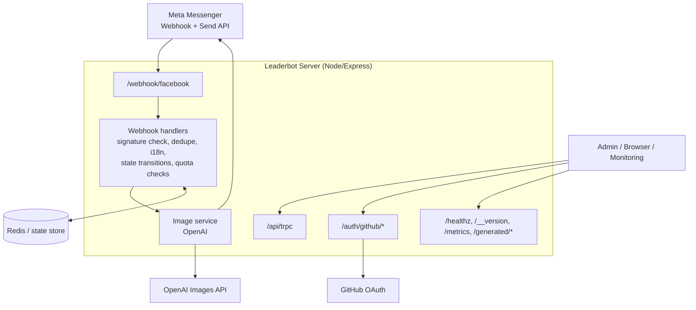

# Leaderbot AI Image Generator
[](https://github.com/Dj-Shortcut/leaderbot-fb-image-gen/actions/workflows/fallow.yml)

A Meta messaging bot with a shared bot-core for Messenger and WhatsApp.

The active product scope is photo-to-image styling and related bot infrastructure. This repository also contains some experimental or legacy experience modules, but they are not part of the current Leaderbot direction and should not be treated as planned product work.

## Product Scope

Current repository focus:

- photo-first image generation flows for Messenger and WhatsApp
- shared text handling across both Meta channels
- channel-specific media ingress and outbound message rendering
- operational tooling around state, quota, storage, security, and deployment

## Architecture

The runtime is a single Node/Express process that handles Meta webhook traffic, channel-specific outbound messaging API calls, shared bot/conversation logic, AI image generation orchestration, static asset serving, admin auth, and operational endpoints.

ASCII version:

```text
                         +----------------------+
                         |   Meta Messenger     |
                         |  Webhook + Send API  |
                         +----------+-----------+
                                    |
                                    v
                    +----------------------------------+
                    |  Leaderbot Server (Node/Express) |
                    |----------------------------------|
                    | Routes:                          |
                    | - /webhook/facebook              |
                    | - /api/trpc                      |
                    | - /auth/github/*                 |
                    | - /healthz, /__version, /metrics|
                    | - /generated/*         |
                    +----+---------------+-------------+
                         |               |
          inbound events |               | outbound API / auth / storage
                         v               v
        +--------------------------+   +----------------------+
        | Webhook Handlers         |   | Supporting Services  |
        | - signature verification |   | - GitHub OAuth       |
        | - dedupe + i18n          |   | - static file serve  |
        | - state transitions      |   | - health/debug       |
        | - quota checks           |   +----------------------+
        +------------+-------------+
                     |
                     v
        +--------------------------+
        | Image Service            |
        | - OpenAI image generator |
        +------------+-------------+
                     |
          +----------+----------+
          |                     |
          v                     v
        +-------------------+   +----------------------+
        | Redis / State     |   | OpenAI Images API    |
        | - state store     |   | - generation backend |
        | - rate limit base |   +----------------------+
        +-------------------+
```

Mermaid version:



Key server entrypoint: `server/_core/index.ts`.
Webhook route registration: `server/_core/messengerWebhook.ts`.
Messenger webhook orchestration: `server/_core/webhookHandlers.ts`.
Normalized inbound message contract: `server/_core/normalizedInboundMessage.ts`.
Shared text/domain handler: `server/_core/sharedTextHandler.ts`.
Outbound response intent types and adapter mapping: `server/_core/botResponse.ts` and `server/_core/botResponseAdapters.ts`.
Bot core boundary and feature entrypoint: `server/_core/bot/index.ts` and `server/_core/bot/features.ts`.

For a deeper explanation, see [`docs/architecture.md`](docs/architecture.md).
Operational and audit notes live under [`docs/`](docs/).

## State model

Conversation state is modeled per Messenger user (`psid`) with a normalized shape in `MessengerUserState`.

Primary stages:

- `IDLE`
- `AWAITING_PHOTO`
- `AWAITING_STYLE`
- `PROCESSING`
- `RESULT_READY`
- `FAILURE`

State persistence model:

- Default: in-memory `Map` state store (fast local/dev fallback).
- Optional: Redis-backed state store when `REDIS_URL` is configured.
- A pseudonymous `userKey` is derived from `psid` (`HMAC-SHA256`) for privacy-safe correlation.

Relevant files:

- `server/_core/bot/features.ts` (future bot feature hooks)
- `server/_core/messengerState.ts`
- `server/_core/stateStore.ts`
- `server/_core/privacy.ts`
- `drizzle/schema.ts` (DB table definitions, including `messengerState`)

## Bot-core extension model

The repository is now organized around an explicit bot-core boundary:

- `server/_core/bot/index.ts` exposes the Messenger bot runtime entrypoints used by server bootstrap.
- `server/_core/bot/features.ts` is the dedicated extension point for future bot features.

The built-in registry now starts with foundational bot middleware-style features such as rate limiting, style handling, conversational editing, and admin stats. Future bot features should prefer registering text/payload/image handlers there via `registerBotFeature(...)` instead of expanding unrelated web or admin codepaths.

Repository changes should prioritize the current styling product and the supporting multi-channel bot/runtime foundation. Do not treat older experiment scaffolding as the roadmap by default.

## Multi-channel text flow

Text handling is now split into three layers:

- Channel adapters at the edge parse Messenger and WhatsApp webhook payloads into a normalized inbound shape.
- Shared domain logic in `server/_core/sharedTextHandler.ts` operates on that normalized shape and returns channel-agnostic bot intents.
- Channel adapters map outbound `BotResponse` intents into Messenger or WhatsApp send calls.

Current scope is intentionally limited to text messages. Media/image handling is still channel-specific and will be moved later once the shared contracts are expanded.

Further boundary work should continue to reduce coupling between channel adapters and shared bot logic without expanding obsolete experiment paths.

## WhatsApp image flow

WhatsApp now supports the same core customer journey as Messenger:

- inbound image webhooks are accepted on the shared Meta callback route
- WhatsApp media is downloaded through the Cloud API using the inbound media id
- the source image is persisted to a reusable public URL for follow-up style picks
- users can pick style groups and styles over plain text replies
- generated images are returned through the WhatsApp Cloud API image send endpoint

Because the persisted source image is fetched again during generation, `SOURCE_IMAGE_ALLOWED_HOSTS` must include the hostname used for those stored source images. In local/dev setups this is usually the `APP_BASE_URL` host. In production it should include the public asset host returned by the storage layer.

## Quota model

There are two quota layers in the codebase, each with a 2-image/day free limit:

1. **Messenger flow quota in state** (`server/_core/messengerQuota.ts`)
   - Stored with `quota.dayKey` + `quota.count` in the user conversation state.
   - Resets by UTC day key.

2. **Database-backed quota** (`dailyQuota` table, used by DB helpers)
   - Tracks per-user daily usage (`YYYY-MM-DD`, UTC).
   - Includes atomic reserve/release helpers for safer concurrent updates.

Related files:

- `server/_core/messengerQuota.ts`
- `server/db.ts`
- `drizzle/schema.ts`
- `drizzle/0001_big_the_phantom.sql`
- `drizzle/0002_fix_daily_quota_unique.sql`

## Env vars

### Required

- `JWT_SECRET` (required at startup; must be at least 32 chars)
- `PRIVACY_PEPPER` (required at startup, used for user-key hashing)
- `FB_VERIFY_TOKEN` (Webhook verification)
- `META_VERIFY_TOKEN` (preferred generic Meta webhook verification token; falls back to `FB_VERIFY_TOKEN` when unset)
- `FB_PAGE_ACCESS_TOKEN` (Messenger send API)
- `FB_APP_SECRET` (Webhook signature validation)
- `WHATSAPP_ACCESS_TOKEN` (WhatsApp Cloud API send API)
- `WHATSAPP_PHONE_NUMBER_ID` (WhatsApp Cloud API sender identity)
- `SOURCE_IMAGE_ALLOWED_HOSTS` (required for inbound source-image fetching; if unset, source-image fetches are blocked; review regularly and keep only trusted domains)
- `REDIS_URL` (required in production for webhook replay protection)
- `APP_BASE_URL` (required for public generated image URLs; must be `https://` in production)
- `OPENAI_API_KEY` (required for image generation)

### Common optional

- `WEBHOOK_REPLAY_TTL_SECONDS` (override webhook replay-protection TTL, default `300`)
- `HTTP_RATE_LIMIT_WINDOW_MS` (global HTTP rate-limit window, default `60000`; Redis-backed when `REDIS_URL` is set)
- `HTTP_RATE_LIMIT_MAX_REQUESTS` (max requests per IP per window, default `120`)
- `OPENAI_IMAGE_TIMEOUT_MS`, `FB_IMAGE_FETCH_TIMEOUT_MS` (per-request timeouts; OpenAI defaults to `30000ms` and applies per retry attempt)
- `OPENAI_IMAGE_MAX_RETRIES`, `OPENAI_IMAGE_RETRY_BASE_MS` (retry policy for OpenAI image edits on `408`/`429`/`5xx`/transient network errors)
- `DEFAULT_MESSENGER_LANG` (`nl`/`en` fallback behavior)
- `PRIVACY_POLICY_URL` (link sent in privacy quick reply)
- `MESSENGER_MAX_IMAGE_JOBS` (global cap for concurrent image generations, default `3`)
- `MESSENGER_PSID_COOLDOWN_MS` (optional per-PSID cooldown between generations, default `0`)
- `MESSENGER_PSID_LOCK_TTL_MS` (per-PSID in-flight lock TTL, default `120000`)
- `GRAPH_API_MAX_RETRIES`, `GRAPH_API_RETRY_BASE_MS` (retry policy for Meta Graph API `429`/`5xx` responses)
- `MESSENGER_CHAT_ENGINE` (`legacy|responses`; defaults to `legacy`)
- `MESSENGER_CHAT_CANARY_PERCENT` (0-100 deterministic rollout for Messenger free-text responses; default `0`)
- `OPENAI_TEXT_MODEL` (model for Messenger free-text Responses API, default `gpt-4.1-mini`)
- `MESSENGER_CHAT_HISTORY_LIMIT` (chat-memory window size for Messenger free-text, default `12`)
- `MESSENGER_CHAT_HISTORY_TTL_SECONDS` (chat-memory TTL for Messenger free-text, default `604800`)
- `OPENAI_TEXT_TIMEOUT_MS` (timeout per Responses text request, default `12000`)
- `OPENAI_TEXT_MAX_RETRIES` (retry attempts for retryable Responses failures, default `1`)
- `ADMIN_TOKEN` (protects `/debug/build`)
- `NODE_ENV` (set to `production` to enforce production-only checks such as required `REDIS_URL`)
- `GITHUB_CLIENT_ID`, `GITHUB_CLIENT_SECRET`, `GITHUB_CALLBACK_URL` (enable GitHub admin login)
- `ADMIN_GITHUB_USERS` (comma-separated GitHub usernames allowed into `/admin`)
- `OAUTH_SERVER_URL` (enables OAuth route initialization)
- `LOG_LEVEL`, `DEBUG_STATE_DUMP`, `DEBUG_IMAGE_PROOF` (diagnostics)
- `MESSENGER_QUOTA_BYPASS_IDS` (comma-separated PSIDs or hashed user keys that skip Messenger daily quota; intended for internal testing/admin)
- `PORT` (default `8080`)
- `BUILT_IN_FORGE_API_URL`, `BUILT_IN_FORGE_API_KEY` (used by the storage proxy contract; in production image generation these should point to the R2-backed proxy so generated Messenger attachment URLs are durable across Fly machines; they also gate `/api/chat`, which stays disabled and returns HTTP 503 when either is missing/blank)
- `VITE_APP_ID`, `DATABASE_URL`, `OWNER_OPEN_ID`, `BUILT_IN_FORGE_API_URL`, `BUILT_IN_FORGE_API_KEY` (app/data integrations exposed via `server/_core/env.ts`)

Legacy/app-specific environment variables also exist for SDK and data API integrations in `server/_core/env.ts`.

### Messenger text brain rollout (hybrid fallback)

- `legacy` mode keeps deterministic behavior for free-text fallback responses.
- `responses` mode enables OpenAI Responses API only for unmatched free-text messages.
- Canary is deterministic per user key: set `MESSENGER_CHAT_ENGINE=responses` and gradually raise `MESSENGER_CHAT_CANARY_PERCENT` (for example: `10`, `25`, `50`, `100`).
- If Responses fails (timeout, API error, invalid output, missing key), the webhook falls back to the existing deterministic text behavior without changing image/state/quota logic.

### Secret hygiene

- Never commit real `.env` files; only keep `.env.example` in git.
- If a secret appears in GitHub code search (for example by searching for `.env` in this repo), rotate all exposed credentials immediately.

## API documentation

The API is served through `tRPC` at `/api/trpc`, with types inferred directly from server routers.

For a human-readable reference of current procedures, auth requirements, and input/output shapes, see [`docs/trpc-api.md`](docs/trpc-api.md).

## Local dev

```bash
pnpm install
pnpm dev
```

Server defaults to `http://localhost:8080`.

Useful checks while developing:

```bash
curl http://localhost:8080/healthz
curl http://localhost:8080/__version
curl http://localhost:8080/metrics
```

Production build locally:

```bash
pnpm build
pnpm start
```

## Testing

Core test/lint/typecheck commands:

```bash
pnpm test
pnpm check
pnpm lint
pnpm lint:server
```

Database migration helpers:

```bash
pnpm db:push
```

The repository includes focused unit tests for webhook handling, state transitions, signature verification, and image generation behavior under OpenAI configuration.

Multi-channel text routing now also has a small adapter-level test in `server/botResponseAdapters.test.ts` to verify `BotResponse` mapping independently from webhook payload parsing.

## Documentation standards

- Prefer JSDoc/TSDoc comments for exported functions, classes, interfaces, and non-trivial internal helpers.
- Write comments so they are parsable by tooling (for example, typed params/returns and clear behavior notes), making API-document generation easier.
- Keep documentation comments synchronized with implementation changes; when behavior, inputs, or outputs change, update the docblock in the same PR.
- Remove stale comments rather than leaving outdated guidance in place.

## Style additions

When adding or updating image styles, use [`docs/style-guide.md`](docs/style-guide.md) as the quality and consistency checklist for prompts, previews, naming, and review.
For Facebook/Messenger share assets, use [`docs/invite-image-export-checklist.md`](docs/invite-image-export-checklist.md) as the required export, naming, and cache-busting workflow.

## Admin login (GitHub OAuth)

The same server can protect `/admin` using GitHub OAuth and a simple allowlist.

Required environment variables for admin login:

- `GITHUB_CLIENT_ID`
- `GITHUB_CLIENT_SECRET`
- `GITHUB_CALLBACK_URL` (example: `https://<app>/auth/github/callback`)
- `ADMIN_GITHUB_USERS` (comma-separated GitHub usernames, example: `Dj-Shortcut`)
- `JWT_SECRET` (used to sign the `admin_session` cookie)

GitHub OAuth app setup:

1. Create a GitHub OAuth App.
2. Set the callback URL to the same value as `GITHUB_CALLBACK_URL`.
3. Configure the server env vars above.
4. Visit `/auth/github/start` or `/admin` to begin login.

Behavior:

- `/auth/github/start` redirects to GitHub with `read:user`.
- `/auth/github/callback` validates the CSRF state cookie, fetches the GitHub user, and only allows usernames from `ADMIN_GITHUB_USERS`.
- Successful logins receive an `admin_session` JWT cookie valid for 7 days.
- `POST /auth/logout` clears the admin session.

## Security: webhook signature verification

Incoming `POST /webhook/facebook` requests are authenticated using Meta's `X-Hub-Signature-256` header.

- Signature format must be `sha256=<hex-digest>`.
- The server captures the **raw request body** (`express.json({ verify })`) and computes `HMAC-SHA256(rawBody, FB_APP_SECRET)`.
- Signatures are compared with `timingSafeEqual` to avoid timing side channels.
- Missing/invalid signatures return `403`.

The signature middleware is only applied on the Messenger webhook POST route.

## Security: request body limits

The server uses a `10mb` limit for both `express.json` and `express.urlencoded` parsers.
Oversized payloads return `413` with a friendly JSON response:

```json
{
  "error": "Payload too large",
  "message": "Request body exceeds the 10mb limit."
}
```

## Deployment notes

This app is configured for Fly.io using `Dockerfile` + `fly.toml`.

### Durable image storage

Production Messenger image delivery should use the R2-backed storage proxy described in [`docs/storage-proxy-r2.md`](docs/storage-proxy-r2.md).

Main app settings:

- `BUILT_IN_FORGE_API_URL=https://leaderbot-storage-proxy.fly.dev`
- `BUILT_IN_FORGE_API_KEY=<same bearer token configured as FORGE_API_KEY on the proxy>`

Proxy app notes:

- The deployed Fly app is `leaderbot-storage-proxy`
- The separate empty Fly app `storage-proxy` is not used
- Preferred proxy commands are:

```bash
fly status -a leaderbot-storage-proxy
fly logs -a leaderbot-storage-proxy --no-tail
fly deploy --depot=false -a leaderbot-storage-proxy
fly secrets list -a leaderbot-storage-proxy
```

Typical deployment flow:

```bash
fly secrets set REDIS_URL=redis://<user>:<password>@<host>:<port> -a <app-name>
fly secrets set KEY=value -a <app-name>
fly deploy -a <app-name>
fly logs -a <app-name>
```

Operational notes:

- `NODE_ENV=production` and `PORT=8080` are expected in runtime.
- `REDIS_URL` must be set in Fly secrets before deploy; production startup now fails without it.
- `WHATSAPP_ACCESS_TOKEN` and `WHATSAPP_PHONE_NUMBER_ID` must be set in Fly secrets before deploy; startup now fails when either is missing.
- Health check endpoint is `/healthz`.
- `/metrics` exposes Prometheus-style request counters and latency histograms.
- Each request carries an `X-Request-Id` header for simple request tracing across logs and downstream calls.
- The server accepts and returns `traceparent` so it can plug into OpenTelemetry-compatible tracing later without changing route behavior.
- `APP_BASE_URL` must be publicly reachable in OpenAI mode so Messenger can fetch generated images from `/generated/<id>.png`.
- Keep `FB_APP_SECRET` configured to enforce webhook signature verification middleware.
- Outbound WhatsApp sends use `server/_core/whatsappApi.ts` and the WhatsApp Cloud API `phone_number_id` configured through env, not hardcoded values.
- Set `SOURCE_IMAGE_ALLOWED_HOSTS` in production. Source-image fetches fail closed when it is unset. `fbcdn.net,fbsbx.com` is a conservative Meta-focused starting point, but the preferred setup is to narrow this to the exact attachment hostnames you observe in your Messenger webhook traffic.
- For WhatsApp source-image reuse, also include the host that serves persisted inbound source images, such as your app host in local/dev or your storage public domain in production.
