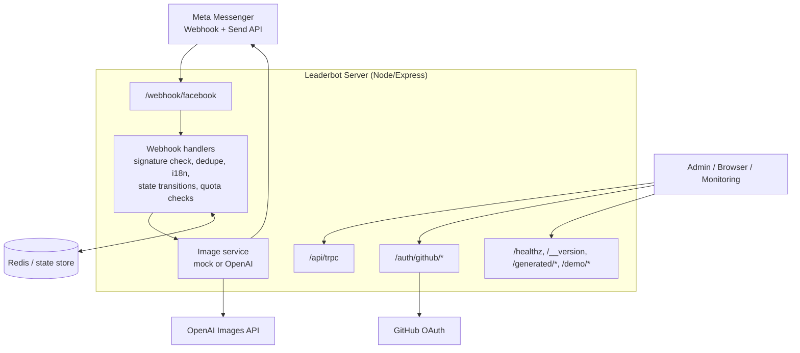

# Leaderbot AI Image Generator

A zero-friction Facebook Messenger bot that transforms user photos into AI-styled images.

## Architecture

The runtime is a single Node/Express process that handles Messenger webhook traffic, AI image generation orchestration, static asset serving, admin auth, and operational endpoints.

ASCII version:

```text
                         +----------------------+
                         |   Meta Messenger     |
                         |  Webhook + Send API  |
                         +----------+-----------+
                                    |
                                    v
                    +----------------------------------+
                    |  Leaderbot Server (Node/Express) |
                    |----------------------------------|
                    | Routes:                          |
                    | - /webhook/facebook              |
                    | - /api/trpc                      |
                    | - /auth/github/*                 |
                    | - /healthz, /__version, /metrics|
                    | - /generated/*, /demo/*         |
                    +----+---------------+-------------+
                         |               |
          inbound events |               | outbound API / auth / storage
                         v               v
        +--------------------------+   +----------------------+
        | Webhook Handlers         |   | Supporting Services  |
        | - signature verification |   | - GitHub OAuth       |
        | - dedupe + i18n          |   | - static file serve  |
        | - state transitions      |   | - health/debug       |
        | - quota checks           |   +----------------------+
        +------------+-------------+
                     |
                     v
        +--------------------------+
        | Image Service            |
        | - mock generator         |
        | - OpenAI generator       |
        +------------+-------------+
                     |
          +----------+----------+
          |                     |
          v                     v
        +-------------------+   +----------------------+
        | Redis / State     |   | OpenAI Images API    |
        | - state store     |   | - generation backend |
        | - rate limit base |   +----------------------+
        +-------------------+
```

Mermaid version:



Key server entrypoint: `server/_core/index.ts`.
Webhook route registration: `server/_core/messengerWebhook.ts`.
Webhook orchestration: `server/_core/webhookHandlers.ts`.

For a deeper explanation, see [`docs/architecture.md`](docs/architecture.md).

## State model

Conversation state is modeled per Messenger user (`psid`) with a normalized shape in `MessengerUserState`.

Primary stages:

- `IDLE`
- `AWAITING_PHOTO`
- `AWAITING_STYLE`
- `PROCESSING`
- `RESULT_READY`
- `FAILURE`

State persistence model:

- Default: in-memory `Map` state store (fast local/dev fallback).
- Optional: Redis-backed state store when `REDIS_URL` is configured.
- A pseudonymous `userKey` is derived from `psid` (`HMAC-SHA256`) for privacy-safe correlation.

Relevant files:

- `server/_core/messengerState.ts`
- `server/_core/stateStore.ts`
- `server/_core/privacy.ts`
- `drizzle/schema.ts` (DB table definitions, including `messengerState`)

## Quota model

There are two quota layers in the codebase, each with a 2-image/day free limit:

1. **Messenger flow quota in state** (`server/_core/messengerQuota.ts`)
   - Stored with `quota.dayKey` + `quota.count` in the user conversation state.
   - Resets by UTC day key.

2. **Database-backed quota** (`dailyQuota` table, used by DB helpers)
   - Tracks per-user daily usage (`YYYY-MM-DD`, UTC).
   - Includes atomic reserve/release helpers for safer concurrent updates.

Related files:

- `server/_core/messengerQuota.ts`
- `server/db.ts`
- `drizzle/schema.ts`
- `drizzle/0001_big_the_phantom.sql`
- `drizzle/0002_fix_daily_quota_unique.sql`

## Env vars

### Required

- `JWT_SECRET` (required at startup; must be at least 32 chars)
- `PRIVACY_PEPPER` (required at startup, used for user-key hashing)
- `FB_VERIFY_TOKEN` (Webhook verification)
- `FB_PAGE_ACCESS_TOKEN` (Messenger send API)
- `FB_APP_SECRET` (Webhook signature validation)
- `SOURCE_IMAGE_ALLOWED_HOSTS` (required for inbound source-image fetching; if unset, source-image fetches are blocked)
- `REDIS_URL` (required in production for webhook replay protection)
- `APP_BASE_URL` (required when `GENERATOR_MODE=openai` for public generated image URLs)
- `OPENAI_API_KEY` (required when `GENERATOR_MODE=openai`)

### Common optional

- `GENERATOR_MODE` (`mock|openai`; defaults effectively to `openai`)
- `WEBHOOK_REPLAY_TTL_SECONDS` (override webhook replay-protection TTL, default `300`)
- `HTTP_RATE_LIMIT_WINDOW_MS` (global HTTP rate-limit window, default `60000`; Redis-backed when `REDIS_URL` is set)
- `HTTP_RATE_LIMIT_MAX_REQUESTS` (max requests per IP per window, default `120`)
- `OPENAI_IMAGE_TIMEOUT_MS`, `FB_IMAGE_FETCH_TIMEOUT_MS` (per-request timeouts; OpenAI defaults to `30000ms` and applies per retry attempt)
- `OPENAI_IMAGE_MAX_RETRIES`, `OPENAI_IMAGE_RETRY_BASE_MS` (retry policy for OpenAI image edits on `408`/`429`/`5xx`/transient network errors)
- `DEFAULT_MESSENGER_LANG` (`nl`/`en` fallback behavior)
- `PRIVACY_POLICY_URL` (link sent in privacy quick reply)
- `ADMIN_TOKEN` (protects `/debug/build`)
- `GITHUB_CLIENT_ID`, `GITHUB_CLIENT_SECRET`, `GITHUB_CALLBACK_URL` (enable GitHub admin login)
- `ADMIN_GITHUB_USERS` (comma-separated GitHub usernames allowed into `/admin`)
- `OAUTH_SERVER_URL` (enables OAuth route initialization)
- `LOG_LEVEL`, `DEBUG_STATE_DUMP` (diagnostics)
- `X-Request-Id` (optional inbound tracing header; server echoes it or generates one)
- `traceparent` (optional W3C Trace Context header; server continues the trace and emits a new server span)
- `MESSENGER_MAX_IMAGE_JOBS` (global cap for concurrent image generations, default `3`)
- `MESSENGER_PSID_COOLDOWN_MS` (optional per-PSID cooldown between generations, default `0`)
- `MESSENGER_PSID_LOCK_TTL_MS` (per-PSID in-flight lock TTL, default `120000`)
- `MESSENGER_QUOTA_BYPASS_IDS` (comma-separated PSIDs or hashed user keys that skip Messenger daily quota; intended for internal testing/admin)
- `GRAPH_API_MAX_RETRIES`, `GRAPH_API_RETRY_BASE_MS` (retry policy for Meta Graph API `429`/`5xx` responses)
- `PORT` (default `8080`)

Legacy/app-specific environment variables also exist for SDK and data API integrations in `server/_core/env.ts`.

### Secret hygiene

- Never commit real `.env` files; only keep `.env.example` in git.
- If a secret appears in GitHub code search (for example by searching for `.env` in this repo), rotate all exposed credentials immediately.

## Local dev

```bash
pnpm install
pnpm dev
```

Server defaults to `http://localhost:8080`.

Useful checks while developing:

```bash
curl http://localhost:8080/healthz
curl http://localhost:8080/__version
curl http://localhost:8080/metrics
```

Production build locally:

```bash
pnpm build
pnpm start
```

## Testing

Core test/lint/typecheck commands:

```bash
pnpm test
pnpm check
pnpm lint
pnpm lint:server
```

Database migration helpers:

```bash
pnpm db:push
```

The repository includes focused unit tests for webhook handling, state transitions, signature verification, and image generation behavior under mock/OpenAI configuration.

## Admin login (GitHub OAuth)

The same server can protect `/admin` using GitHub OAuth and a simple allowlist.

Required environment variables for admin login:

- `GITHUB_CLIENT_ID`
- `GITHUB_CLIENT_SECRET`
- `GITHUB_CALLBACK_URL` (example: `https://<app>/auth/github/callback`)
- `ADMIN_GITHUB_USERS` (comma-separated GitHub usernames, example: `Dj-Shortcut`)
- `JWT_SECRET` (used to sign the `admin_session` cookie)

GitHub OAuth app setup:

1. Create a GitHub OAuth App.
2. Set the callback URL to the same value as `GITHUB_CALLBACK_URL`.
3. Configure the server env vars above.
4. Visit `/auth/github/start` or `/admin` to begin login.

Behavior:

- `/auth/github/start` redirects to GitHub with `read:user`.
- `/auth/github/callback` validates the CSRF state cookie, fetches the GitHub user, and only allows usernames from `ADMIN_GITHUB_USERS`.
- Successful logins receive an `admin_session` JWT cookie valid for 7 days.
- `POST /auth/logout` clears the admin session.

## Security: webhook signature verification

Incoming `POST /webhook/facebook` requests are authenticated using Meta's `X-Hub-Signature-256` header.

- Signature format must be `sha256=<hex-digest>`.
- The server captures the **raw request body** (`express.json({ verify })`) and computes `HMAC-SHA256(rawBody, FB_APP_SECRET)`.
- Signatures are compared with `timingSafeEqual` to avoid timing side channels.
- Missing/invalid signatures return `403`.

The signature middleware is only applied on the Messenger webhook POST route.

## Security: request body limits

The server uses a `10mb` limit for both `express.json` and `express.urlencoded` parsers.
Oversized payloads return `413` with a friendly JSON response:

```json
{
  "error": "Payload too large",
  "message": "Request body exceeds the 10mb limit."
}
```

## Deployment notes

This app is configured for Fly.io using `Dockerfile` + `fly.toml`.

Typical deployment flow:

```bash
fly secrets set REDIS_URL=redis://<user>:<password>@<host>:<port> -a <app-name>
fly secrets set KEY=value -a <app-name>
fly deploy -a <app-name>
fly logs -a <app-name>
```

Operational notes:

- `NODE_ENV=production` and `PORT=8080` are expected in runtime.
- `REDIS_URL` must be set in Fly secrets before deploy; production startup now fails without it.
- Health check endpoint is `/healthz`.
- `/metrics` exposes Prometheus-style request counters and latency histograms.
- Each request carries an `X-Request-Id` header for simple request tracing across logs and downstream calls.
- The server accepts and returns `traceparent` so it can plug into OpenTelemetry-compatible tracing later without changing route behavior.
- `APP_BASE_URL` must be publicly reachable in OpenAI mode so Messenger can fetch generated images from `/generated/<id>.png`.
- Keep `FB_APP_SECRET` configured to enforce webhook signature verification middleware.
- Set `SOURCE_IMAGE_ALLOWED_HOSTS` in production. Source-image fetches fail closed when it is unset. `fbcdn.net,fbsbx.com` is a conservative Meta-focused starting point, but the preferred setup is to narrow this to the exact attachment hostnames you observe in your Messenger webhook traffic.
