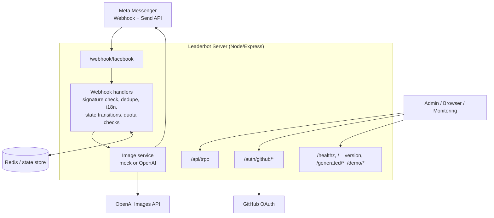

# Architecture and Runtime Model

## 1) Runtime topology

Leaderbot runs as one Node.js process (Express + HTTP server):

- Accepts Messenger webhook traffic.
- Executes conversation flow + generation orchestration.
- Serves static assets (`/demo`, `/generated`, web build output).
- Exposes health/version/debug endpoints.
- Exposes Prometheus-style metrics and request tracing hooks.
- Optionally mounts OAuth and additional chat routes.

Primary bootstrap is in `server/_core/index.ts`.

## Architecture diagrams

ASCII version:

```text
                         +----------------------+
                         |   Meta Messenger     |
                         |  Webhook + Send API  |
                         +----------+-----------+
                                    |
                                    v
                    +----------------------------------+
                    |  Leaderbot Server (Node/Express) |
                    |----------------------------------|
                    | Routes:                          |
                    | - /webhook/facebook              |
                    | - /api/trpc                      |
                    | - /auth/github/*                 |
                    | - /healthz, /__version          |
                    | - /generated/*, /demo/*         |
                    +----+---------------+-------------+
                         |               |
          inbound events |               | outbound API / auth / storage
                         v               v
        +--------------------------+   +----------------------+
        | Webhook Handlers         |   | Supporting Services  |
        | - signature verification |   | - GitHub OAuth       |
        | - dedupe + i18n          |   | - static file serve  |
        | - state transitions      |   | - health/debug       |
        | - quota checks           |   +----------------------+
        +------------+-------------+
                     |
                     v
        +--------------------------+
        | Image Service            |
        | - mock generator         |
        | - OpenAI generator       |
        +------------+-------------+
                     |
          +----------+----------+
          |                     |
          v                     v
        +-------------------+   +----------------------+
        | Redis / State     |   | OpenAI Images API    |
        | - state store     |   | - generation backend |
        | - rate limit base |   +----------------------+
        +-------------------+
```

Mermaid version:



## 2) Request flow (Messenger)

1. Meta sends webhook event to `POST /webhook/facebook`.
2. Signature middleware validates payload when `FB_APP_SECRET` is present.
3. `processFacebookWebhookPayload` fans in to webhook handlers.
4. Handler dedupes inbound events (`TtlDedupeSet`) and resolves language.
5. Handler inspects event kind:
   - quick reply / postback payload,
   - photo attachment,
   - text message.
6. State is updated (`setFlowState`, `setPendingImage`, `setChosenStyle`, ...).
7. If generation is triggered:
   - state -> `PROCESSING`,
   - image generator selected (`mock` vs `openai`),
   - result sent via Messenger send API,
   - state -> `RESULT_READY` (or `FAILURE` on error).

Core files:

- `server/_core/messengerWebhook.ts`
- `server/_core/webhookHandlers.ts`
- `server/_core/imageService.ts`
- `server/_core/messengerApi.ts`

## 3) State model details

`MessengerUserState` is canonical runtime state. It stores:

- stage/status (`IDLE` .. `FAILURE`)
- latest photo URL fields
- selected style and optional preselected referral style
- preferred language
- pending/generated image references
- quota counters (`dayKey`, `count`)
- update timestamp

Persistence abstraction (`stateStore`) supports:

- **In-memory map** (default, easy local dev).
- **Redis** (if `REDIS_URL` configured), with TTL semantics.

Design intent:

- Keep state minimal and directly tied to Messenger flow.
- Normalize legacy/alias fields during reads.
- Avoid storing raw PSID in logs; derive `userKey` for correlation.

## 4) Quota model details

There are two quota strategies represented in code:

### A. Messenger in-state quota

- Implemented in `server/_core/messengerQuota.ts`.
- Daily key derived in UTC (`YYYY-MM-DD`).
- Limit currently hardcoded to `1` generation/day.
- Used with state store abstraction.

### B. DB-backed quota

- Implemented via `dailyQuota` table + helpers in `server/db.ts`.
- Unique index on `(userId, date)`.
- Includes atomic reservation/release helpers for concurrent workers.

This duality supports both direct Messenger state-based throttling and account/user-centric quota tracking in DB-backed flows.

## 5) Configuration model

Configuration is environment-variable driven.

- Critical startup checks: privacy and generator config.
- Route behavior toggled by env presence (e.g. OAuth routes).
- Debug/observability endpoints guarded via `ADMIN_TOKEN`.

See README env section for operationally relevant variables.

## 6) Deployment model (Fly.io)

- Build artifact is produced with `pnpm build` (Vite client + bundled server).
- Runtime starts `node dist/index.js`.
- `fly.toml` defines app runtime, HTTP service, and `/healthz` checks.
- Must expose a public `APP_BASE_URL` for Messenger to fetch generated files.

## 7) Failure handling and resilience

- Webhook acknowledgement is immediate; heavy work is deferred.
- Inbound dedupe reduces duplicate event processing.
- Generation failures produce user-facing retry options.
- Health endpoints + version endpoint support simple monitoring.

## 8) Core module boundaries

To keep `server/_core` from growing into a single flat namespace, domain entrypoints are now grouped by responsibility:

- `server/_core/auth/index.ts` for auth-related bootstrap imports (OAuth route registration and auth env assertions).
- `server/_core/messenger/index.ts` for webhook ingress concerns (raw-body capture, signature verification, webhook route registration).
- `server/_core/image-generation/index.ts` for image-generator startup wiring.

These entrypoints let server bootstrap code import by domain while remaining backward compatible with existing module files.

